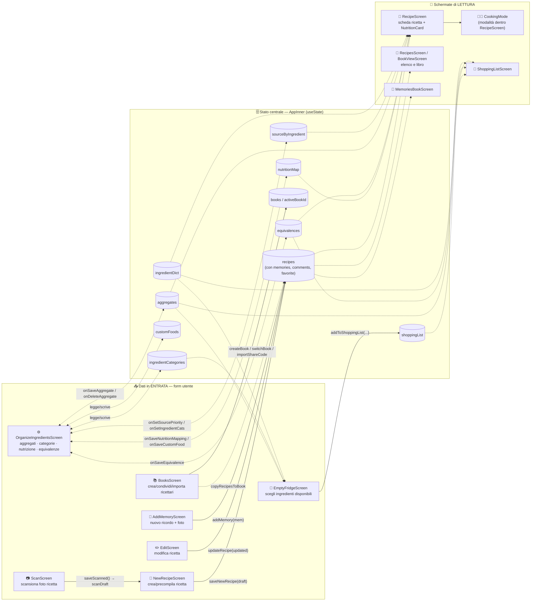
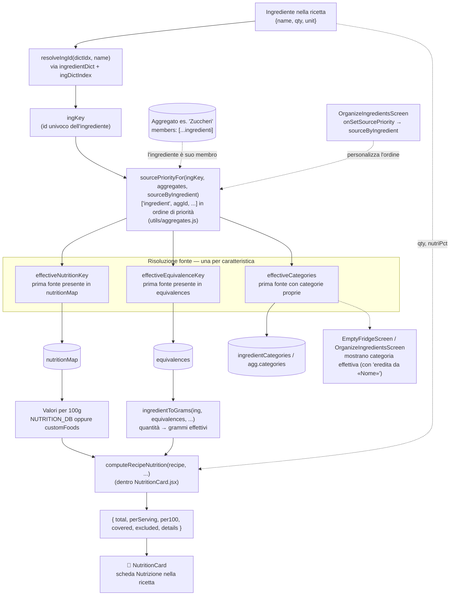
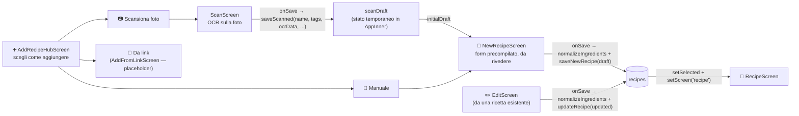

# Architettura dei dati — Il mio Ricettario

Questo documento descrive come i dati si muovono nell'app, dopo il refactoring che ha
spostato le schermate in `src/screens/`, i pezzi riusabili in `src/components/`, la logica
pura in `src/utils/`, i dati iniziali in `src/data/` e il tema/contesto in `src/context.js`.
Lo stato vero e proprio vive tutto in `AppInner` (dentro `src/ricettario-v23.jsx`), che lo
passa alle schermate tramite props.

Solo documentazione: nessun file di codice è stato modificato per generare questi diagrammi.

---

## Diagramma 1 — Vista d'insieme

Le grandi aree dell'app: da dove entrano i dati digitati dall'utente, dove restano
"in memoria" (gli stati di `AppInner`), e quali schermate li leggono per mostrarli.
Le frecce piene sono scritture verso lo stato; quelle tratteggiate sono letture.

**Note di lettura:**
- `memories` e `comments` non sono uno stato globale a parte: vivono dentro ogni ricetta
  (`recipe.memories`, `recipe.comments`). `MemoriesBookScreen` li raccoglie da tutte le
  ricette per mostrare il "Libro dei Ricordi".
- `OrganizeIngredientsScreen` è l'unica schermata che **legge e scrive insieme** quasi tutto
  lo stato "di sistema" (categorie, aggregati, nutrizione, equivalenze, priorità delle fonti):
  è il pannello di configurazione condiviso da tutto il resto dell'app.
- `AddFromLinkScreen` non è nel diagramma: è un segnaposto ("in arrivo"), non scrive ancora
  su nessuno stato.
- `books` con `data:null` per il libro attivo significa che i dati del ricettario in uso
  vivono negli stati sopra; cambiare libro (`switchBook`) fa uno snapshot dello stato
  corrente dentro `books` e ricarica quello nuovo.

---

## Diagramma 2 — Zoom sul cuore: nutrizione + aggregati

Questo è il flusso più "intelligente" dell'app: come si calcola la nutrizione di una
ricetta tenendo conto dell'ereditarietà dagli aggregati. L'idea chiave è che ogni
ingrediente ha un **ordine di priorità delle fonti** (`sourcePriorityFor`), e le tre
caratteristiche (nutrizione, equivalenze, categorie) lo usano ciascuna a modo suo per
decidere "chi vince": l'ingrediente stesso o uno degli aggregati di cui è membro.

**Note di lettura:**
- `sourcePriorityFor` scarta automaticamente le priorità salvate che non sono più valide
  (aggregato cancellato, ingrediente non più membro): non serve nessuna pulizia manuale.
- `effectiveCategories` è leggermente diverso dagli altri due: non ritorna solo una
  "chiave" ma già il risultato pronto (`{ categories, inheritedFrom }`), perché le categorie
  di un aggregato non vivono in una mappa condivisa ma direttamente su `agg.categories`.
- Se nessuna fonte nell'ordine di priorità possiede il dato (es. nessuna mappatura
  nutrizionale, né sull'ingrediente né sugli aggregati), l'ingrediente finisce in
  `excluded`/`details` con lo stato `"unlinked"` — mai un valore inventato.
- `ingredientToGrams` converte in grammi solo se l'unità è di peso diretta (g/kg/ml/l/cl/dl)
  oppure se l'equivalenza risolta ha una `base` di peso con un fattore per quell'unità.

---

## Diagramma 3 — Creazione/importazione di una ricetta

Flusso a parte perché intreccia tre percorsi di ingresso (manuale, scansione, link) che
convergono tutti sullo stesso form, e usa uno stato-ponte temporaneo (`scanDraft`) che
il codice commenta esplicitamente: *"NON salva subito, ma apre il form manuale
precompilato... così si possono correggere prima di salvare."*

**Note di lettura:**
- `scanDraft` esiste solo per far transitare i dati letti dalla foto (OCR) dentro il form
  di `NewRecipeScreen`: non tocca mai direttamente `recipes`.
- Sia la creazione (`saveNewRecipe`) sia la modifica (`updateRecipe`, via `EditScreen`)
  passano dalla stessa funzione `normalizeIngredients` prima di scrivere su `recipes`, per
  garantire coerenza dei dati (quantità numeriche, righe vuote scartate, `nutriPct`
  validata).
- `AddFromLinkScreen` è collegato al menu ma non è ancora attivo: mostra un messaggio
  "in arrivo" (`ComingSoon`) e non scrive nulla.

---

*Generato leggendo `src/ricettario-v23.jsx` (funzione `AppInner`), `src/utils/aggregates.js`,
`src/utils/helpers.js`, `src/components/NutritionCard.jsx` e le schermate in `src/screens/`.*
